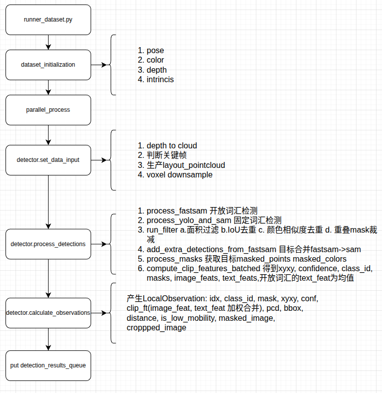
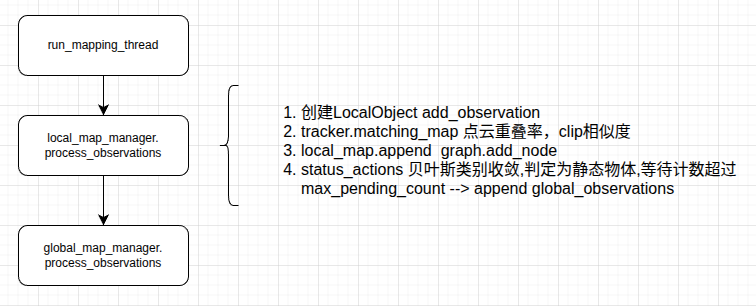
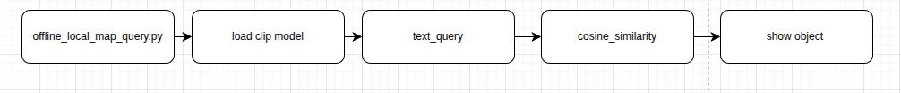
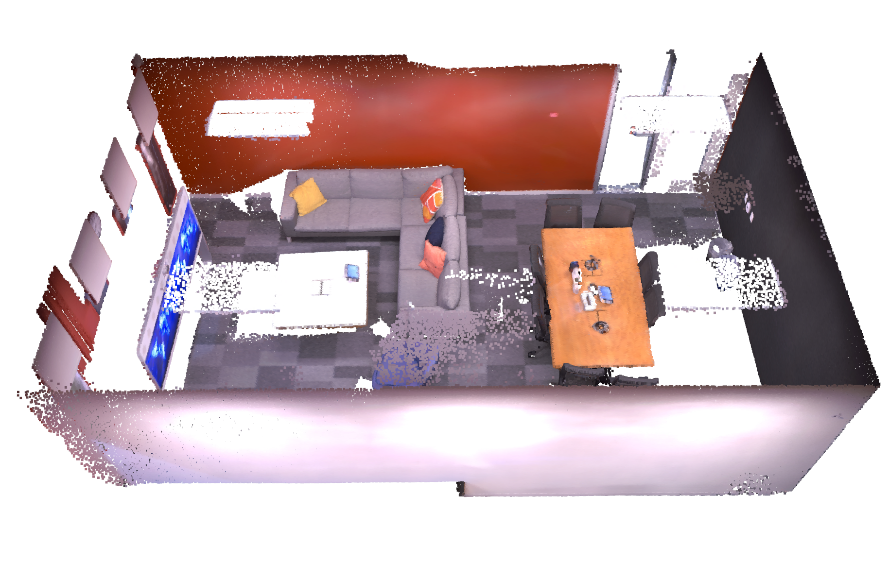
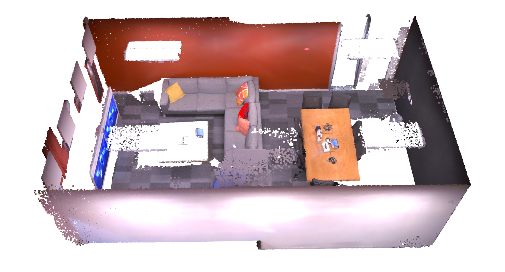
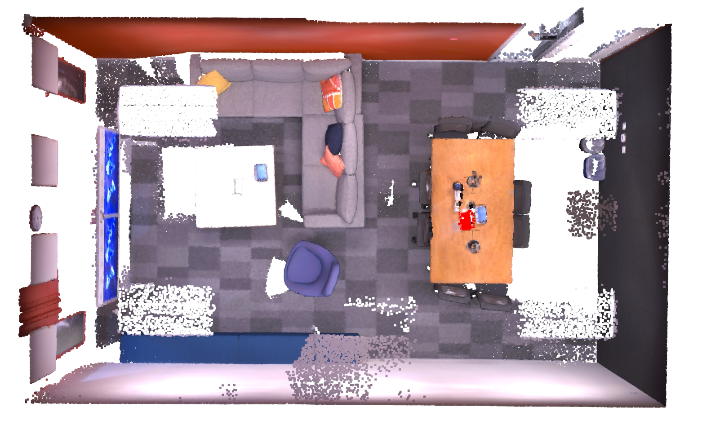
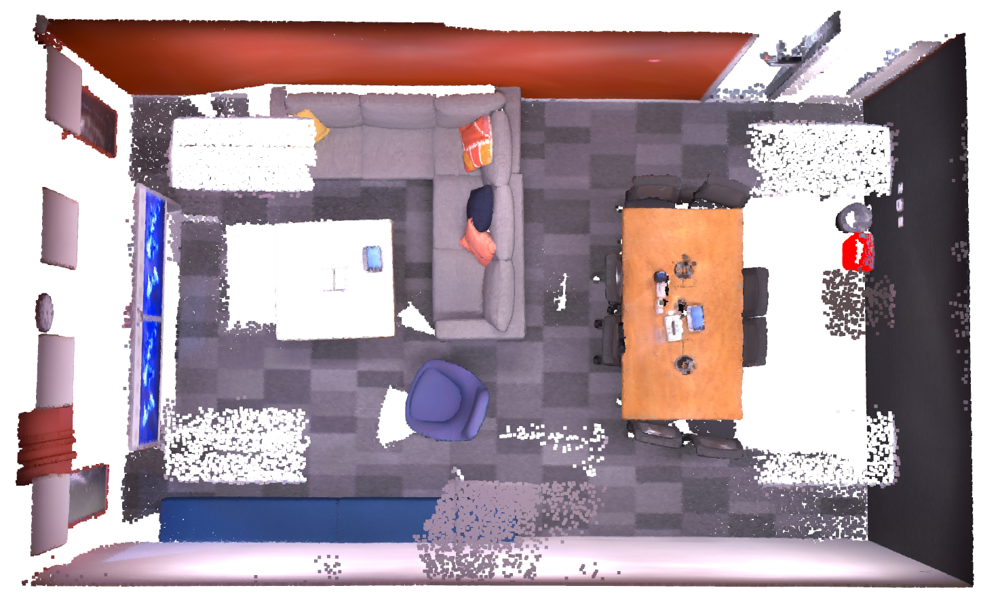

# 按照readme创建环境
https://github.com/Eku127/DualMap

# # 使用数据集运行：
## ## 下载replica数据集：
```
wget https://cvg-data.inf.ethz.ch/nice-slam/data/Replica.zip
```
修改base_config_yaml中的dataset_path 路经

## 构建地图：
```
python -m applications.runner_dataset
```

## ## 导航查询：
```
python -m applications.offline_local_map_query
```


# 代码逻辑分析：
## 建图部分

<div style="text-align: center;">
  
</div>

<div style="text-align: center;">
  
</div>


## 查询部分

<div style="text-align: center;">
  
</div>

# 效果演示：
<div style="text-align: center;">
  
</div>

### query pillows
<div style="text-align: center;">
  
</div>

### query 垃圾桶
<div style="text-align: center;">
  
</div>

### query trash
<div style="text-align: center;">
  
</div>